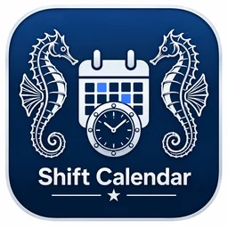

# Shift Calendar — Offline Security Calendar

An independent GPLv3 customization of Fossify Calendar for offline Android personnel/post scheduling. The active application branch is **security/offline-shifts-v1**, draft PR #1. This is a **hardware-test preview**, not a production-accepted release or full conformance claim.

## Main workflow
Add Personnel and Posts, create required shifts and staffing counts, then assign personnel directly or enter successive person/date/time/post blocks. Choose the year and time zone. The calendar and schedule board place assignments and show unfilled or partly filled shifts. Required shifts exist independently of assignments: a blank calendar does not prove coverage.

Version `0.1.0-preview02` adds explicit per-entry review with parsed person, date expression and normalized dates, time, post, new-assignment count and duplicate count. Supported copied README bullet markers are accepted. All detected conflicts and unresolved fields are shown; invalid batches cannot be saved. Cancel leaves stored data unchanged. The exact Mark/Bill/Tate README examples create 12/14/3 assignments in all six person orders. Four-line or pipe syntax is deterministic; this is not an unrestricted prose/AI parser.

Several people can cover one shift and multiple posts may operate simultaneously. Selected-weekday requirements and copies generate finite date ranges. Existing shift patterns can be reused. Overnight shifts belong to their START dates and show actual end dates/time zones. The board provides date-range, person, post, shift/time, coverage, conflict and search filters with automatic chronological ordering.

## Offline input, sharing and backup
- Native keyboard and supported installed-device handwriting use the authorized read/copy-only Inventory-App pattern. No recognition model is downloaded or cloud handwriting API called by this app. Test the installed keyboard offline on the actual device.
- Manual SMS/copy, individual composer, selected-shift sharing, confirmed opt-in direct individual batches, and Android Share are available. No SMS is sent merely by editing a schedule. A Wi-Fi-only tablet must transfer exports to a carrier-capable phone for SMS.
- Readable UTF-8 .txt with Windows line endings, date/person/post filtering and date/post/person grouping can be saved locally or copied for Word. Use USB to transfer to Windows 11; real device/Word acceptance remains pending.
- App-private local database with revision-checked atomic changes, password-protected authenticated encrypted backups and validated restore. The password cannot be recovered.
- Local reminders, the approved navy seahorse/calendar/clock icon, and user-confirmed home-screen pinning.

## Build and installation
Use **Offline Calendar APK** on this branch. Only a run whose build and both device-test jobs succeed qualifies its artifact. The artifact name is **Shift-Calendar-preview-APK-<run number>**; install only `Shift-Calendar-0.1.0-preview02.apk`, not the separate instrumented-test APK. This commit's new tests must pass before replacing the previously verified preview01.

See [installation and quick start](docs/INSTALL_PREVIEW.md), [full requirements conformance audit](docs/README_CONFORMANCE_AUDIT.md), [continuation state](docs/CONTINUATION.md), and [source/artwork provenance](docs/THIRD_PARTY_NOTICES.md).

APK identity is separate from official Fossify Calendar. API26 is the technical minimum. **Galaxy S25 and Galaxy Tab S7** are required physical acceptance targets. CI/emulators do not certify Samsung handwriting, carriers, reminders or physical layouts. Preview debug certificates can change: back up before updating and never uninstall a data-bearing installation without a restorable backup.

The installed app has no Internet or OS calendar-provider permissions, no cloud account/telemetry/runtime model download, and disables automatic Android data backup. Build-machine dependency downloads are separate from offline runtime. External keyboard, SMS, share and document apps retain their own permissions.

## Remaining requirements and release gates
The planning README is not fully satisfied yet. An independent Templates manager/library, arbitrary selected-multiple-person SMS picker and user-selectable board sort controls remain open. Pattern reuse, single-person/all-matched sharing and chronological ordering are implemented but are not silently relabeled as those missing features.

Stable protected production signing, tested data-bearing upgrades, large-roster performance, physical S25/Tab S7 handwriting/layout/SMS/reminder acceptance and USB/Word printing remain gates. Recurrences generate finite ranges; reminders currently use a 90-day horizon. Legacy Fossify personal-calendar editors, widgets and ICS workflows are retained in source but not exposed in this preview.

## License and repository boundaries
Original [GNU GPLv3 license](LICENSE) and copyright notices remain. Exact corresponding source and build scripts accompany the APK. This is not an official Fossify release. Writable repositories are this user-approved application fork and the separately authorized planning repository. **FossifyOrg/Calendar** and **antonioavila-bit/Inventory-App** are read/copy-only donors and must not be modified.
